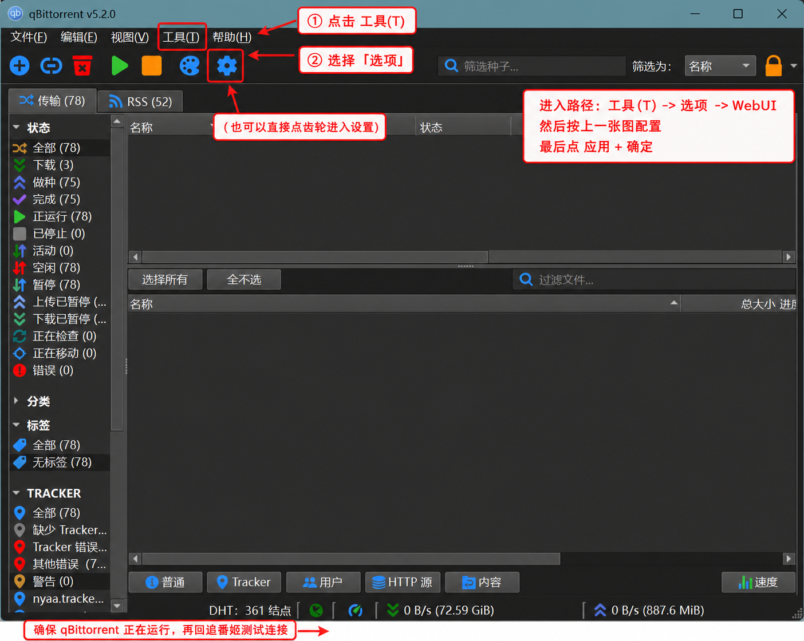
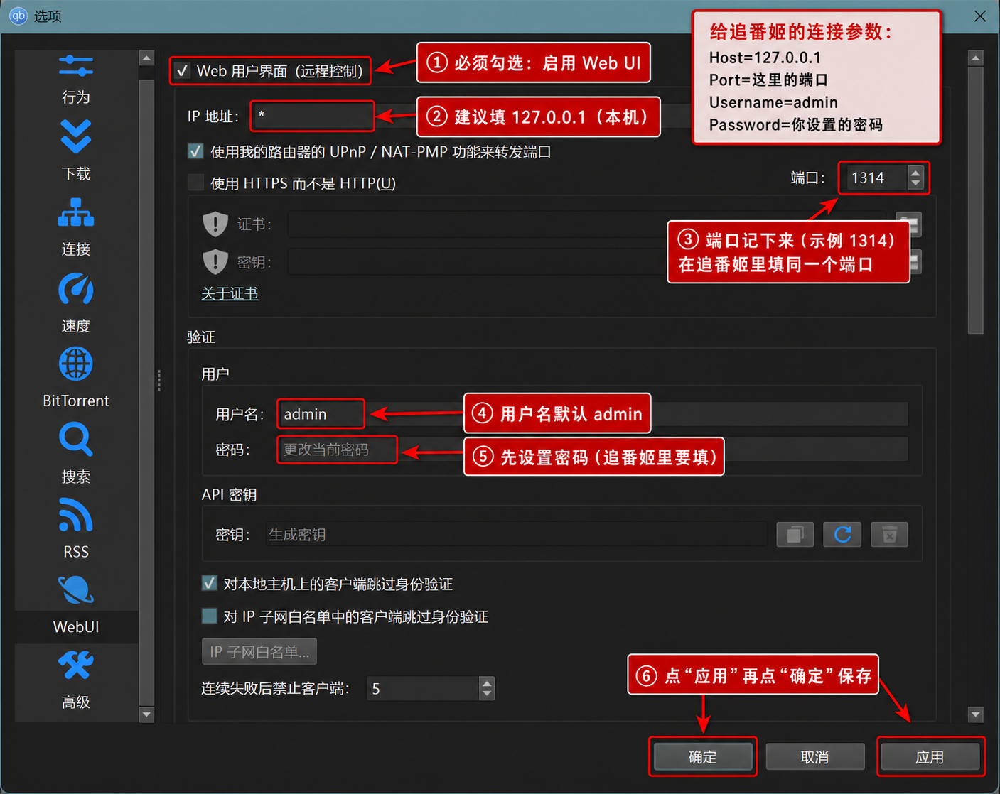

# 🎌 anime-season-rss · 追番姬 zhuifanji

> Seasonal anime → RSS → qBittorrent, on desktop. Browse the season, one-click subscribe, auto-download, track what you've watched.

每季度初从 [yuc.wiki](https://yuc.wiki) 抓取当季番单 → 双路匹配蜜柑计划 RSS → 按字幕组优先级自动添加到本地 qBittorrent，附带媒体库与播放进度追踪。

---

## 功能概览

| 模块 | 功能 |
|------|------|
| **📺 季度订阅** | 从 yuc.wiki 加载当季番单，卡片网格展示，一键订阅；封面可点击跳转 BGM 页面 |
| **📋 订阅管理** | 查看/删除单条订阅，取消时同步删除 qBittorrent RSS 规则、种子及本地目录 |
| **🗑️ 季度清理** | 超过保留期限的季度一键清理，可选是否同时删除文件 |
| **⚙️ 设置** | 配置 qBittorrent 连接、字幕组优先级、下载路径 |
| **🎬 媒体库** | 扫描下载目录，网格/列表两种视图，继续观看、播放进度追踪（需配合 PotPlayer） |

---

## 快速开始

### 1. 安装依赖

```bash
uv sync
uv run scrapling install   # 首次安装 Scrapling 浏览器驱动
```

### 2. 配置

复制 `config.example.yaml` 为 `config.yaml`，按需修改：

```yaml
qbittorrent:
  host: localhost
  port: 8080
  username: admin
  password: your_password
  save_path: "D:/Anime"       # 下载根目录，同时作为媒体库扫描路径

subtitle_priorities:          # 字幕组优先级（关键词匹配，不区分大小写）
  - ANi
  - kirara

cleanup:
  keep_quarters: 2            # 保留最近 N 个季度

advanced:
  use_mirror: false           # 网络受限时改为 true，使用 mikanime.tv 镜像
```

### 3. 启动

桌面 GUI（推荐）：

```bash
uv sync --group gui
uv run python gui_main.py
```

---

## 订阅流程详解

### 双路匹配机制

订阅时按以下顺序查找蜜柑计划对应番剧：

1. **直接名称匹配**：用季度索引（`build_season_index` 预建）将 yuc.wiki 标题与蜜柑当季所有番剧直接比对
2. **BGM ID 回退**：直接匹配失败时，调用 bgm.tv API 搜索（返回前 10 个结果），用 bgm_id 列表与蜜柑页面内嵌的 bgm 链接逐一比对，确保跨季续集（如咒术回战第三期）也能正确命中

匹配成功后，从蜜柑页面提取 BGM subject ID，自动为封面添加 bgm.tv 跳转链接。

### RSS 过滤规则

| 场景 | 策略 |
|------|------|
| 简体内嵌（CHS/CHS&CHT） | `mustContain=CHS`，只下简体版本 |
| 多来源（CR + ABEMA 等） | 按优先级锁定单一来源（B-Global > Baha > Abema > CR > Bilibili），`smartFilter=false`，确保历史集数全部下载 |
| 单来源 | `smartFilter=true`，防止同集重复 |

> **为何多来源时关闭 smartFilter**：qBittorrent 新建规则时，`smartFilter=true` 会将 RSS 现有条目全部标记为"已处理"，导致只下载规则创建后的新集数。单来源锁定后无需去重，关闭 smartFilter 可确保补全历史集数。

### 取消订阅

取消订阅同时执行：
1. 删除 qBittorrent RSS Feed
2. 删除 qBittorrent 自动下载规则
3. 按 category 查找并删除对应种子（`delete_files=false`，先释放文件句柄）
4. 用 `shutil.rmtree` 删除本地下载目录

---

## 媒体库与播放追踪

### PotPlayer 集成（推荐）

媒体库通过本地 `watch_history.json`、PotPlayer 播放列表历史和 Windows Recent Files 合并追踪观看进度，**推荐使用 PotPlayer**。

**配置步骤**：

1. 下载安装 [PotPlayer](https://potplayer.tv/)（64位）
2. 在 PotPlayer 中：**选项 → 播放 → 播放列表 → 保存最近播放记录** 勾选
3. 本应用会自动读取 PotPlayer 标准播放列表历史：`%APPDATA%\PotPlayerMini64\Playlist\PotPlayerMini64.dpl`
4. 如果从媒体库页面点击剧集播放，应用会同步写入运行目录的 `watch_history.json`

播放记录中包含文件路径和最后播放时间，媒体库据此显示：
- 橙色进度条：观看进行中
- 绿色进度条：已看完（≥90%）
- **继续观看**区：显示有进度但未完结的番剧

### 播放脚本（可选）

运行目录附带 `potplayer_tracker.as`（AngelScript 模板），可实现显式播放日志：
- 先把 `MEDIA_ROOT` 改成 `config.yaml` 里的 `qbittorrent.save_path`
- 再把 `LOG_FILE` 改成运行目录下的 `potplayer_plays.txt`
- 放入 PotPlayer 的 AngelScript 扩展目录并启用

`watch_history.json` 和 `potplayer_plays.txt` 是本地运行数据，已加入 `.gitignore`，不会进入仓库。

---

## 封面缓存

- **`.cover_cache/`**：订阅时预取的 yuc.wiki 封面，永久保留，不随刷新缓存删除
- **`assets/covers/`**：从 mikanani 抓取的高清封面，按 bangumi_id 存储
- **刷新缓存**按钮只清除季度索引（season_index）和 bgm 映射缓存，封面不受影响，媒体库历史封面始终可用

---

## 打包为 EXE（Windows）

### 1. 安装依赖

```bash
uv sync
```

### 2. 构建

```bash
build_exe.bat
```

输出目录：`dist/zhuifanji/zhuifanji.exe`

### 3. 运行与数据目录说明

- 开发模式：配置和状态写入项目根目录
- EXE 模式：配置和状态写入 **exe 同目录**
- 首次运行若无 `config.yaml`，可从 `config.example.yaml` 复制

---

## 桌面 GUI（PyQt6）

PyQt6 原生桌面版（`gui/`），已覆盖以下页面：
- `Dashboard`：季度概览、当前订阅、最近更新媒体
- `Season Subscribe`：季度番单、封面展示、点击封面跳转 BGM、订阅/取消订阅
- `Subscription Manage`：订阅列表与按季度删除
- `Quarter Cleanup`：按保留季度批量清理 + 清理历史
- `Media Library`：封面网格/列表、继续观看、点击封面查看剧集详情并播放
- `Settings`：qBittorrent、字幕优先级、清理与高级参数、自动刷新、连接测试

### 启动方式

```bash
uv sync --group gui
uv run python gui_main.py
```

> 已切换为 PyQt6 打包链路（`zhuifanji.spec` + `gui_main.py`），发布版可双击运行，无需安装 Python / uv。

---

## 自动刷新

在「⚙️ 设置」新增了：
- `开启自动刷新`
- `刷新间隔（秒）`

开启后，主页与业务页面会自动按间隔刷新（适合边下载边看状态）。

---

## 中文新手教程（Wiki 草稿）

为 Phase 0 提供的中文小白教程草稿见：
- `docs/wiki/新手教程.md`

可直接复制到 GitHub Wiki 并补充截图标注。下面是 qBittorrent 配置关键截图：

### 1. 从主界面进入 WebUI 设置



### 2. WebUI 参数填写示例



---

## 运行测试

```bash
uv run pytest tests/ -v
```

---

## 已知限制

- 元祖小邦多利等少数番剧不在蜜柑计划当季索引中，需手动搜索
- 部分标题差异较大（如「工坊」vs「工房」）的番剧可能需要手动输入搜索词重试
- 媒体库播放追踪依赖 PotPlayer 播放历史，其他播放器暂不支持
